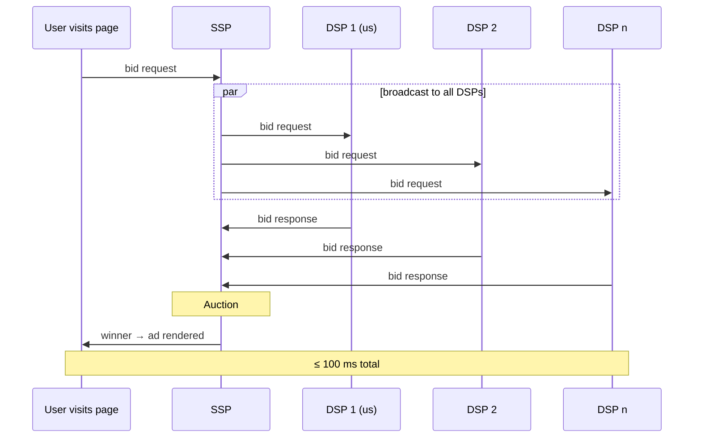

Real-Time Bidding (RTB) is the backbone of programmatic advertising,
processing billions of auctions daily under a hard 100-millisecond latency
constraint. This article introduces the formal probabilistic framework
underlying RTB, derives the optimal bidding strategy in both second-price
and first-price auctions, and shows how the latency constraint transforms the
problem into a joint optimisation over model accuracy and inference speed.
We treat inference latency as a stochastic variable and derive the net
expected utility that accounts for timeout risk.

## The RTB Ecosystem

Before diving into the mathematics, let's map the actors.

### The Players

| Actor | Abbreviation | Role |
|-------|:---:|------|
| Advertiser | --- | Pays to show ads; defines campaign goals (purchases, sign-ups, engagement). |
| Publisher | --- | Owns the website or app inventory; monetises attention. |
| Demand-Side Platform | DSP | Bids on behalf of advertisers. Runs the ML models. This is us. |
| Supply-Side Platform | SSP | Runs the auction on behalf of publishers. |
| Ad Exchange | AdX | Marketplace connecting DSPs and SSPs (often merged with SSP). |
| Data Management Platform | DMP | Aggregates audience data for targeting (cookies, device IDs). |

### The Auction Flow

The following diagram traces a single ad impression from bid request to
ad render.

> [!NOTE]
> The entire round-trip (bid request, ML scoring, bid response, auction,
> creative fetch, render) must complete in under 100 ms. Network
> round-trip alone consumes 20 to 40 ms, leaving the DSP roughly 10 to
> 30 ms for model inference.

## Auction Theory

### A Brief History

The formal study of auctions begins with William Vickrey's seminal 1961
paper, which introduced the *second-price sealed-bid auction* and laid
the groundwork for mechanism design theory. Vickrey showed that in this
format, rational bidders should bid their true value, a property known as
*incentive compatibility*. This result earned him the 1996 Nobel Prize
in Economics.

For two decades, online advertising relied almost exclusively on second-price
auctions, following Vickrey's framework. Around 2019, the industry shifted
to first-price auctions, driven by the rise of header bidding, which broke
the sequential waterfall model that SSPs had relied on. This transition
fundamentally changed the bidding problem: DSPs could no longer simply bid
their true value and had to develop *bid shading* strategies.

We present both settings below, starting from first principles.

### The Probabilistic Framework

Let \((\Omega, \mathcal{F}, \mathbb{P})\) be a probability space. For each
auction opportunity, we observe a feature vector \(x \in \mathcal{X}\). We
define the following random variables:

- \(Y \in \{0, 1\}\): the Bernoulli variable indicating the occurrence
  of a target event (click, conversion, purchase).
- \(M\): the random variable representing the highest competing bid
  (*market price*), with CDF \(F_M\) and density \(f_M\).
- \(v > 0\): the unit value of the event for the advertiser (the *payout*).

The objective of the ML model is to estimate the conditional expectation:

$$
\mu(x) = \mathbb{E}[Y \mid X = x]
$$

### The Value of an Impression

**The advertiser's contract.**
An advertiser does not pay to show ads. They pay for measurable outcomes:
a purchase, a lead, a registration. The contract specifies a fixed
payout \(v > 0\) for each realised event.

*Example.* An e-commerce retailer pays \(v = 5\) euros per completed purchase.

**Not all impressions are equal.**
A user who has recently browsed running shoes is more likely to purchase
than someone who has never visited the retailer's website. The probability
of conversion depends on the user, the context, the time of day, the creative. We write
\(p = \mathbb{P}(Y = 1 \mid X = x) = \mu(x)\).

**Expected value.**
Since \(Y\) is Bernoulli with parameter \(\mu(x)\), the expected value of
showing the ad is:

$$
V(x) = v \cdot \mu(x)
$$

This equation is the reason ML sits at the centre of AdTech. The DSP that
estimates \(\mu(x)\) most accurately knows the true value of each impression
and can bid accordingly.

### Utility and Expected Utility

For a single auction, the realized payout is \(vY\): the advertiser pays
\(v\) if the event occurs (\(Y=1\)) and nothing otherwise. The expected
value \(V(x) = v \cdot \mu(x)\) is simply the expectation of this quantity.

**Definition (Utility).**
In an auction where a bidder with value \(V(x)\) submits bid \(b\) and, upon
winning, pays a cost \(c\), the utility of the outcome is:

$$
U = (vY - c) \cdot \mathbf{1}_{\{b > M\}}
$$

This expression captures both the randomness of the conversion event and the
randomness of the competing bids.

**Why maximise expected utility?**
In RTB, a DSP participates in billions of auctions per day. By the law of
large numbers, the average realised utility converges to its expectation.
Maximising the expected utility per auction is therefore equivalent to
maximising long-run profit. Formally, if \(U_1, U_2, \dots, U_n\) are i.i.d.
utilities across auctions:

$$
\frac{1}{n} \sum_{i=1}^{n} U_i
\xrightarrow{\text{a.s.}} \mathbb{E}[U]
\quad \text{as } n \to \infty
$$

This justifies the expected utility framework as the correct objective for a
risk-neutral bidder operating at scale.

### Second-Price Auctions: Truthful Bidding

In a second-price auction, the highest bidder wins and pays the
second-highest bid: \(c = M\). The utility is
\(U(b, M) = (vY - M) \cdot \mathbf{1}_{\{b > M\}}\).

By the law of iterated expectations, the expected utility conditional on \(x\)
is:

$$
J(b) = \mathbb{E}\bigl[\mathbb{E}[U(b, M) \mid M, X]\bigr]
     = \int_{0}^{b} \bigl(v\mu(x) - m\bigr)\, f_M(m)\, dm
$$

**Proposition 1 (Truthful bidding).**
*In a second-price auction under the IPV (Independent Private Values) model, the bid maximising \(J(b)\)
is \(b^{*} = v \cdot \mu(x)\). Moreover, this strategy is weakly dominant: it yields at least as high a utility as any alternative, regardless of the other bidders' actions.*

*Proof.* The first-order condition gives:

$$
\frac{dJ}{db} = \bigl(v\mu(x) - b\bigr)\, f_M(b) = 0
$$

Since \(f_M(b) > 0\), this yields \(b^{*} = v\mu(x)\). The second-order
condition confirms this is a maximum:

$$
\frac{d^2J}{db^2} = -f_M(b) < 0
$$

To see that the strategy is weakly dominant, compare any bid \(b \neq v\mu(x)\)
to \(b^{*} = v\mu(x)\) for every possible realisation of \(M\):

*Case 1: \(b > v\mu(x)\).* When \(v\mu(x) < M < b\), the bidder wins but
pays \(M > v\mu(x)\), yielding negative expected surplus. Bidding \(b^{*}\) would
not have won: utility \(0\).

*Case 2: \(b < v\mu(x)\).* When \(b < M < v\mu(x)\), bidding \(b^{*}\) wins
with positive expected surplus, while bidding \(b\) loses: utility \(0\).

In both cases, \(b^{*}\) performs at least as well, and strictly better on a set
of positive probability. \(\blacksquare\)

> [!IMPORTANT]
> The beauty of the second-price mechanism is that the optimal strategy does
> not depend on the behaviour of other bidders. Each bidder can act
> independently. In this setting, the entire ML problem reduces to:
> **estimate \(\mu(x)\) well**.

### First-Price Auctions: The Shading Problem

In a first-price auction, the highest bidder wins and pays their own bid:
\(c = b\). The utility becomes
\(U(b, M) = (vY - b) \cdot \mathbf{1}_{\{b > M\}}\).

**The zero-surplus problem.**
If the bidder bids \(b = v\mu(x)\) and wins, the expected surplus is
\(v\mu(x) - v\mu(x) = 0\). The impression is captured but no value is
extracted.

**Expected utility.**
By the law of iterated expectations:

$$
J(b) = \bigl(v\mu(x) - b\bigr) \cdot F_M(b)
$$

This expression reveals a fundamental tension:

- Decreasing \(b\) increases the surplus \((v\mu(x) - b)\) per win, but
  reduces the probability \(F_M(b)\) of winning.
- Increasing \(b\) increases the win probability, but compresses
  the margin.

The optimal bid balances these two forces exactly.

**Proposition 2 (Optimal shading).**
*Assume \(F_M\) is differentiable with \(f_M(b) > 0\) in a neighbourhood
of \(b^{*}\). The bid maximising \(J(b)\) satisfies:*

$$
b^{*} = v\mu(x) - \frac{F_M(b^{*})}{f_M(b^{*})}
$$

*Proof.* Differentiating \(J(b) = (v\mu(x) - b)\,F_M(b)\) with respect to \(b\):

$$
\frac{dJ}{db} = -F_M(b) + (v\mu(x) - b)\,f_M(b)
$$

Setting this to zero:

$$
(v\mu(x) - b)\,f_M(b) = F_M(b)
$$

which rearranges to \(b^{*} = v\mu(x) - F_M(b^{*})/f_M(b^{*})\). The second-order
condition \(d^2J/db^2 < 0\) is satisfied under log-concavity of \(F_M\). \(\blacksquare\)

**Interpretation.**
The quantity \(F_M(b)/f_M(b)\) is the *inverse hazard rate* of the
competing-bid distribution. It governs how much to shade:

- When competition is dense near \(v\mu(x)\) (large \(f_M\)), the ratio is
  small. Shade modestly: bidding far below the value would lose too
  many auctions.
- When competition is sparse (small \(f_M\)), the ratio is large. Shade
  aggressively: there is room to bid well below the value and still win.

> [!NOTE]
> The formula is implicit: \(b^{*}\) appears on both sides. In practice, we
> estimate \(F_M\) and \(f_M\) from historical win/loss data and solve
> numerically. This is the subject of Article 5.

### Summary

| Property | Second-Price | First-Price |
|----------|:---:|:---:|
| Winner pays | 2nd highest bid | Own bid |
| Optimal bid | \(b^{*} = v\mu(x)\) | \(b^{*} = v\mu(x) - \frac{F_M(b^{*})}{f_M(b^{*})}\) |
| DSP complexity | Low | High (requires shading model) |

## Inference Under the Real-Time Constraint

### Latency Budget Decomposition

The latency SLA is driven by user experience: publishers wait for the ad
response before rendering the page, and if the DSP is too slow, the SSP
times out with a "no-bid." The budget breaks down as follows:

| Component | Budget | Constraint |
|-----------|-------:|------------|
| Network round-trip | 30 ms | Geography, CDN placement |
| Feature retrieval | 15 ms | Redis/DynamoDB + feature store latency |
| Model inference | 20 ms | Model complexity, batch size, hardware |
| Post-bid logic | 10 ms | Pacing, frequency capping, budget checks |
| Creative fetch | 15 ms | CDN, creative pre-caching |
| Safety buffer | 10 ms | Variance absorption |
| **Total** | **100 ms** | |

### The Stochastic Deadline

In practice, the latency SLA is not a deterministic wall. The inference
latency is itself a random variable. We define:

$$
\tau = \mathcal{T}(x, \theta)
$$

where \(\theta\) denotes the model parameters (architecture, feature set,
embedding dimensions) and \(\mathcal{T}\) is the inference time function, which
depends on the input complexity and the model.

The effective bid is filtered by the latency constraint:

$$
b_{\text{eff}} = b \cdot \mathbf{1}_{\{\tau \leq T\}}
$$

where \(T\) is the SLA threshold imposed by the exchange (typically around
20 ms for inference).

**The net expected utility.**
The utility that accounts for timeout risk becomes:

$$
J_{\text{net}}(b, \theta)
= \mathbb{E}\Bigl[(vY - \text{cost}) \cdot \mathbf{1}_{\{b > M\}}
  \cdot \mathbf{1}_{\{\mathcal{T}(x, \theta) \leq T\}}\Bigr]
$$

Assuming stochastic independence between the latency and the market price:

$$
J_{\text{net}}(b, \theta) = J(b) \cdot \mathbb{P}\bigl(\mathcal{T}(x, \theta) \leq T\bigr)
$$

> [!IMPORTANT]
> Even if the mean latency is well within the SLA, a model with high variance
> (heavy-tailed latency distribution, often log-normal) will have a p99 that
> exceeds the deadline. Each timeout is a missed auction and lost revenue.
> A model that is "fast on average" but unstable directly amputates the
> expected profit through pure system effects.

### The Joint Optimisation Problem

The model design problem is not simply "maximise accuracy." It is a joint
optimisation over predictive quality and system reliability:

$$
\theta^{*} = \arg\max_{\theta} \int_{\mathcal{X}}
  J\bigl(b^{*}(x, \theta)\bigr) \cdot
  \mathbb{P}\bigl(\mathcal{T}(x, \theta) \leq T\bigr)\,
  d\mathbb{P}(x)
$$

This formulation reveals that \(\theta\) plays two roles simultaneously:

1. **Predictive role**: \(\theta\) determines the quality of
   \(\mu_\theta(x)\), which drives the value of the optimal bid
   \(b^{*}(x, \theta)\).
2. **System role**: \(\theta\) determines the latency distribution
   \(\mathcal{T}(x, \theta)\), which drives the probability of actually
   submitting the bid.

A more complex model improves the first factor (better \(\mu\), better bids)
but degrades the second factor (higher latency, more timeouts). The optimum
lies at the intersection.

### Capacity Planning as a Hyperparameter

This joint optimisation has a concrete engineering consequence: the choice
of model complexity (number of layers, tree depth, embedding dimension) is
not a pure ML decision. It is an economic decision.

- Adding model complexity increases \(\mu\) accuracy (marginal gain in
  profit per won auction).
- But it also increases CPU load, which either raises the latency
  (losing auctions) or requires more servers (increasing cost).

The optimal model is the one that maximises **net economic value**: the
gain from better predictions minus the cost of the infrastructure required
to serve them within the SLA.

### Why Not AUC?

In the previous section we showed that \(V(x) = v \cdot \mu(x)\). The bid is a direct
function of the predicted probability. A model that ranks impressions
correctly but produces poorly calibrated probabilities will systematically
over-bid or under-bid. What we need is *calibration*: that a predicted
\(\hat{p} = 0.03\) truly corresponds to a 3% conversion rate.

Let \(\mathcal{L}(\theta)\) denote a proper scoring rule measuring the quality
of the predicted probabilities (for instance, the log-loss or its normalised
variant, the Normalised Entropy). The constrained engineering problem is:

$$
\min_{\theta} \; \mathcal{L}(\theta) \quad \text{subject to} \quad
\mathbb{P}\bigl(\mathcal{T}(x, \theta) \leq T\bigr) \geq 1 - \alpha
$$

where \(\alpha\) is a tolerance on the timeout rate (e.g. \(\alpha = 0.01\)
for a p99 constraint).

> [!WARNING]
> Discriminative metrics such as AUC measure ranking quality only. They do
> not penalise miscalibration. In RTB, a well-ranked but miscalibrated model
> will bid the wrong amounts. We use proper scoring rules instead. We return
> to this point in Article 2.

## Key Takeaways

1. The RTB ecosystem is a multi-agent system where DSPs compete in
   real-time auctions under strict latency constraints.
2. The value of an impression is \(V(x) = v \cdot \mu(x)\), derived from
   the expected utility framework. Accurate estimation of \(\mu(x)\) is
   the core ML problem.
3. In second-price auctions, bidding \(V(x)\) is optimal. In first-price auctions, the optimal bid satisfies
   \(b^{*} = V(x) - F_M(b^{*})/f_M(b^{*})\), requiring estimation of the competing-bid distribution.
4. Inference latency is a stochastic variable. The effective bid is
   \(b_{\text{eff}} = b \cdot \mathbf{1}_{\{\tau \leq T\}}\). The net
   expected utility integrates timeout risk:
   \(J_{\text{net}} = J(b) \cdot \mathbb{P}(\tau \leq T)\).
5. Every modelling decision is a joint optimisation:
   \(\theta^{*} = \arg\max \int J(b^{*}) \cdot \mathbb{P}(\tau \leq T)\, d\mathbb{P}(x)\).
   Model complexity is both an ML and an economic decision.
6. In production, the bidding pipeline runs scoring, value computation,
   bid shading, and pacing in sequence — each step introduces its own
   modelling challenges, explored in the remaining articles of this series.

